# Parking Security System

A camera watches one parking bay. Three object detectors look at every frame, and a short set of rules decides whether the person at the car is leaving as booked or breaking in.

This repository is the code, the trained weights, and the figures from Arpanjot Singh's BSc dissertation in Computer Science at the University of Reading (supervisor James Ferryman, submitted May 2023). The page you are reading is the illustrated overview. Every figure is described underneath it. The longer chapter, with the same figures and the full argument, is the [model selection report](docs/model-selection-report.md). Class names, confidence thresholds, and file paths are listed in [docs/MODELS.md](docs/MODELS.md).

## About the project

Ordinary CCTV leaves the decision to a person watching a wall of screens. Attention drops quickly, and a theft at one bay is easy to miss. The project replaces that watch with a model that can name what is in the bay: the state of the door, the registration plate, whether the figure is a member of staff, and whether they are holding a tool.

A theft is not a class the network outputs. Early attempts asked a model to say "robber" or "abnormal" directly, and those labels did not hold up on the footage. The version that shipped asks for the pieces, then checks whether the pieces meet:

- the door of this car is open,
- a person is standing on that car,
- the person is not wearing the staff vest,
- a tool, in this footage a car jack, overlaps the person and the car,
- the booking for that plate does not say the car should be leaving today.

Staff are recognised from the high-visibility vest, which is large enough to see from the camera. Faces are not used.

Four designs were built. A pose model, an action classifier, and one detector with seven classes were measured and set aside. Three specialist YOLOv5m detectors are what the dashboard loads.

## What the finished system looks like

The window below is the security dashboard on a staged break-in. The video sits on the left. Three models have already drawn on it, and the banner at the top is the decision.

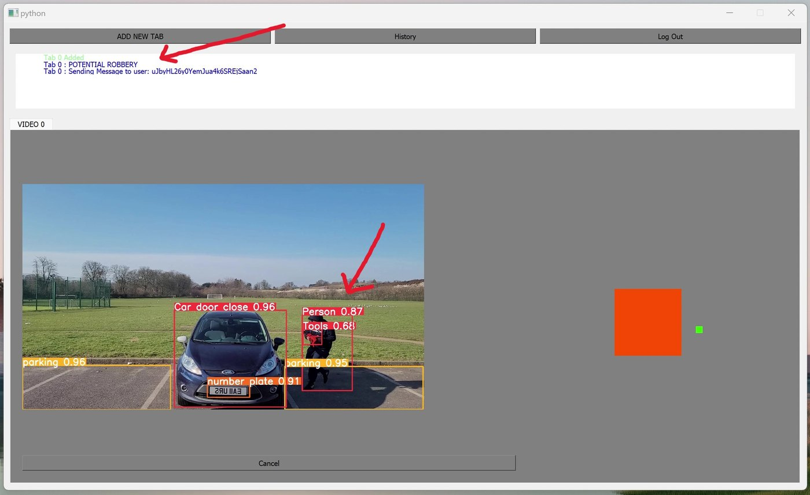

D1, the vehicle model, has drawn `Car door close` at 0.96 around the body of the car, `number plate` at 0.91 on the bumper, and `parking` at 0.96 and 0.95 along the painted bays. D2, the people model, has drawn `Person` at 0.87. The tools model has drawn `Tools` at 0.68 on the jack in the person's hands. The door is shut, so there is no door-open alarm. The tool rectangle meets the person rectangle, so the banner reads **POTENTIAL ROBBERY** and the dashboard has started sending that alert to the client who booked the car. On the grey panel to the right, the same scene is reduced to a top-down plan: an orange block for the car and a green mark for the person. That plan is a homography, a geometry step, not a fourth learned model. Each camera tab runs on its own thread, and a two-second clip is stored when an alert fires.

The next frame is D1 on its own, on a car whose door is shut. This is the picture the relabelled training set was aiming at.

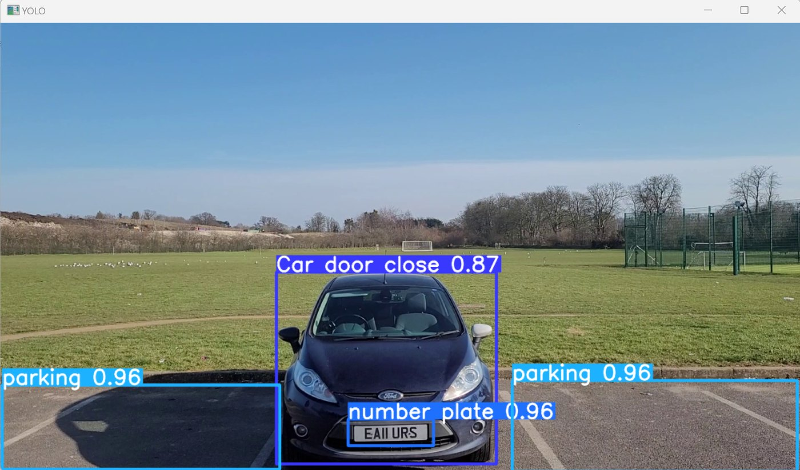

`Car door close` at 0.87 follows the body of the car rather than a loose box of grass and tarmac. `number plate` at 0.96 sits on the plate itself. The two `parking` boxes at 0.96 follow the painted lines of the bays. The plate crop from this box is what EasyOCR reads, so the alert can be matched to a booking. EasyOCR was not trained for this project. It is only the reader for a region D1 has already found.

## The camera these weights actually saw

Every result below depends on one lens. It is mounted about 2.5 m above a single bay and looks along the bay, so the training car is seen from the front and a person at the bumper is seen from head to feet.

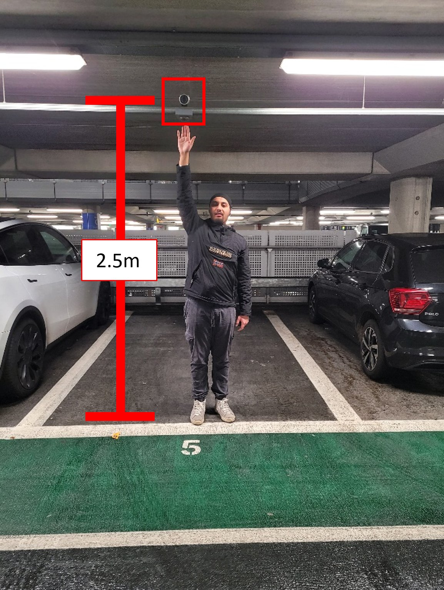
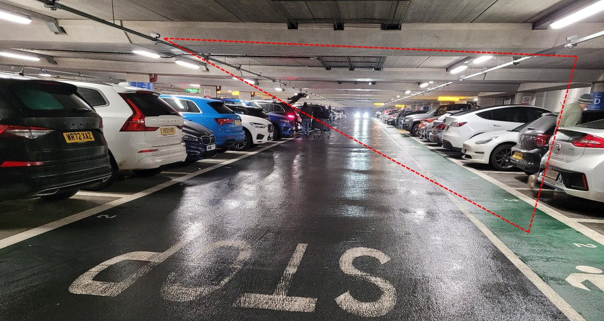

The left photograph is the mounting. The housing is marked in red, and the height is written on the frame as 2.5 m. A standing person can reach it with an outstretched arm, so the view is above head height but not a top-down view into the bay. Cars to either side are seen from the rear quarter, which is a different shape from the front-on car the detectors were trained on.

The right photograph is a real multi-storey aisle, with the wedge one camera would be asked to cover drawn in red. Near the lens the cars are large and partly side-on. At the bright end of the aisle they shrink to a few pixels. A number plate there is not readable, and neither is a jack in someone's hand. That is why a mask class was later abandoned, and why the tools model is the weakest of the three that were kept: small objects disappear first. A reviewer from The Parking Consultancy Ltd made the same point after a demonstration. The detector expects the car from the front, and a camera on every bay, so that every car is front-on, is expensive.

The footage the weights learned from is the front-on view, filmed for the project with participants acting ordinary visits and staged break-ins. It was reduced from 60 frames a second to one still every two seconds, outlined by hand in CVAT, and converted to YOLOv5 labels through Roboflow.

## Why the earlier models were dropped

### A pose cannot see a jack, and it invents a person

The first model was MediaPipe Pose. OpenCV reads the frame, the colours are swapped into the order MediaPipe expects, and the model returns the joints of one body. Nothing is trained on the parking footage. The hope was that a bent arm or a torso over the window would be enough to call a theft.

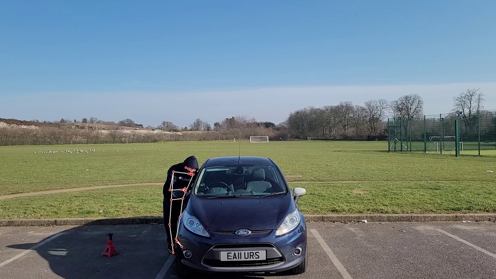

On a clear frame the pose does find the person. Here they are bent over the driver's side in dark clothing. Landmarks sit on the shoulder and the arm, then the lower body collapses into one line down the leg. The red jack on the tarmac, which is the actual tool, has no representation. A rule written on these points would see a bent figure. It would not see the tool, and the leg it read would be in the wrong place.

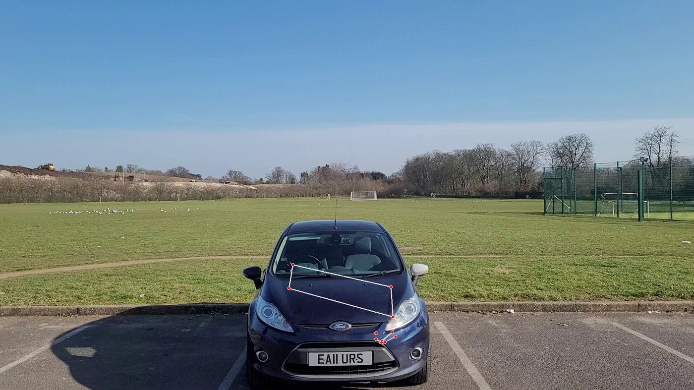

The failure that removes it from a security system is the empty bay. Nobody is in this frame. MediaPipe still returns a body, drawn across the bonnet: a shoulder on the windscreen, a hip near the headlight, a leg running toward the plate. An alert of the form "a person is at the car" would fire on an empty space. Light, greyscale, and lighter clothing were all tried. None of them stopped the model drawing a person who was not there, and none of those controls exist in a real car park. The scripts remain in `MainProjectComponentsDevelopment/Skeleton Extraction`. The dashboard does not load them.

### A high accuracy did not mean the model knew when the break-in happened

The second model classified one-second clips as normal or abnormal. The folder is named `LSTM + RCNN`. The network that was actually trained is a 3D convolutional classifier on the difference between consecutive frames, resized to 64 by 113 pixels. There is no recurrent layer in the training script. Validation accuracy sat between about 0.98 and 1.00, and the saved file records accuracy 0.998279. On the clips it was shown, the two folders were easy to separate.

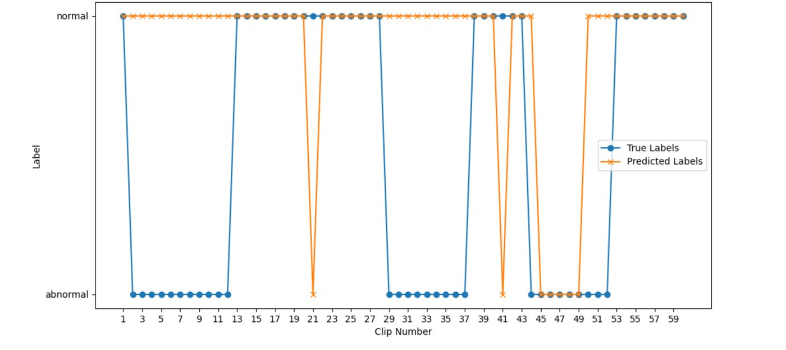

A one-minute test, scored once per second, is the picture above. The blue line is the true label. Three abnormal stretches each last many seconds. The orange line is the prediction. It stays on normal through most of those stretches and marks abnormal as a narrow spike, about 2.3 seconds long and about 2 seconds away from the true event. The model noticed that something in the minute was wrong. It did not say when.

The cause is the difference image. Training footage was shot by hand, so a small camera movement changes every pixel and the difference is full of trees and bay lines. The test footage was shot on a tripod, so the difference is mostly the person. The two inputs do not look alike, which is why the validation score did not survive the test. Cutting the clips had already taken about four days, which was more work than drawing boxes on stills. The weights remain under `MainProjectComponentsDevelopment/LSTM + RCNN`.

### One detector could not tell a robber from a person

YOLOv5 was then trained once, on about 900 images, with seven classes: car, person, staff vest, door open, robber, mask, and parking space. A label counter agreed with the hand-drawn boxes 95% of the time for masks and open doors, and only 44% of the time for robbers. The Ultralytics results file for that run was not saved, so there is no official mAP. The frames were enough to stop.

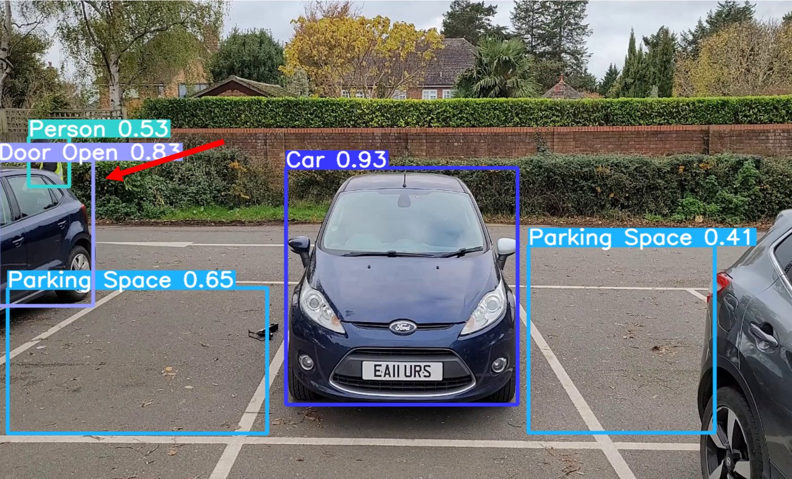

The main car is closed and correctly called `Car` at 0.93. The car on the left is also closed. A sliver of its door, seen edge-on, is called `Door Open` at 0.83. The arrow in the figure marks that box. Parking boxes cover empty tarmac and the neighbouring cars. If the rule is "any open door is an alarm", this frame alarms on a car nobody is touching. On a real break-in frame the same model called the people `Person` and drew no robber box at all. A person forcing a door and a person unlocking their own car were both labelled as ordinary rectangles, and at this distance their clothes do not differ. Vest boxes had been drawn around the whole body, and door boxes included the glass, so the network was taught the person and the hedge as part of the object.

## The labels that the shipped models were trained on

The repair was to split the classes across three models, and to redraw every outline so the box contained the object.

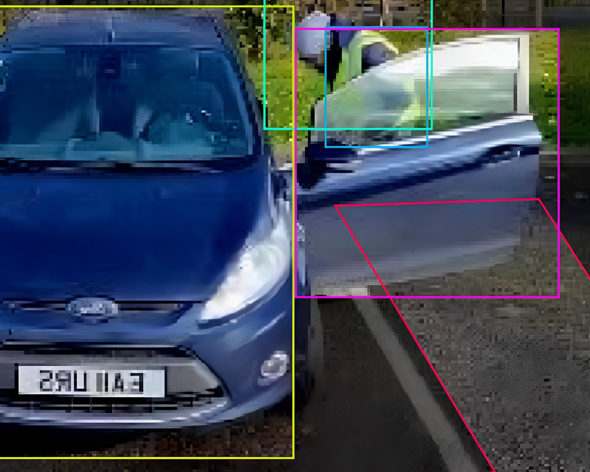
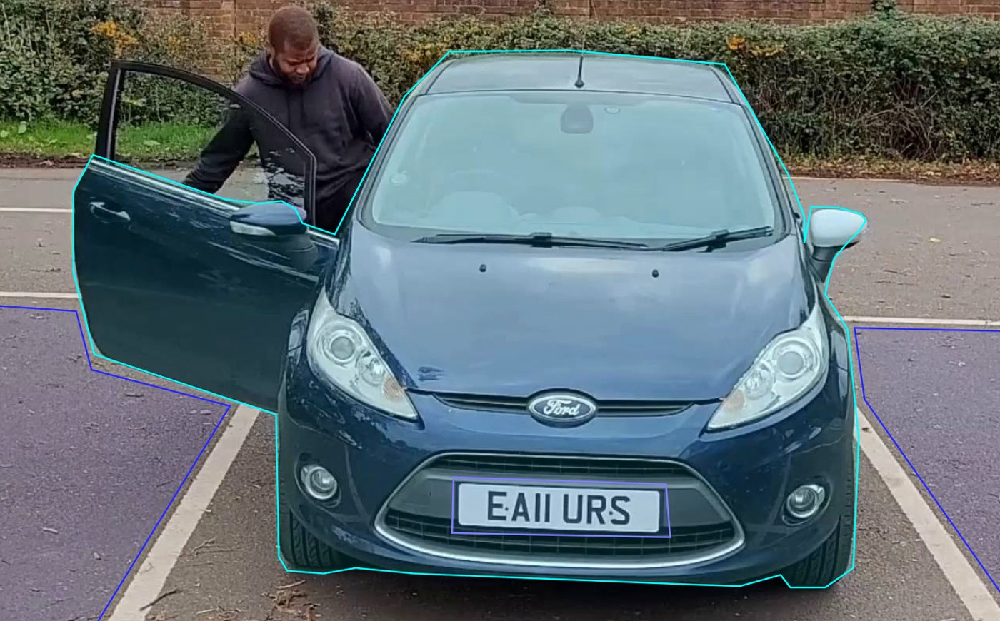

On the left, the old style. The car rectangle takes in a wide margin of the scene. The door rectangle includes the glass and the mirror, so the person and the glare behind the window become part of "door". A parking shape runs off across the tarmac. Small boxes near the mirror try to catch a vest and mostly catch the window.

On the right, the style that was kept. A polygon follows the metal of the car and the open door and stops at the panel. A separate polygon sits on the plate. The bay is drawn along the painted lines. The glass is left outside, which is why D1 can tell a door from the person standing behind it. The same footage was outlined three times, once for each model. A door that was only slightly ajar was relabelled as closed, because the visible panel had barely changed and the model had been swapping those two states.

## The three models, and what the scores mean

All three are YOLOv5m, started from the official pretrained medium weights. YOLOv5 is a single-stage detector: one pass over the image proposes boxes, and each box carries a class name and a confidence. The medium checkpoint was chosen because it has more layers than the small variants, and the objects range from a car that fills the frame to a jack that does not. Training used an image size of 1280×720, batches of 30, 70 epochs, and a 70/20/10 split, on a Lambda Cloud A100. D1 and D2 used about 800 images. The tools model used about 1,200. The recorded training cost over two months was $90.21.

**D1, the vehicle model,** reports `Car door close`, `Car door open`, `number plate`, and `parking`. Its job is the state of the car and which car it is. An open door is only treated as open above a confidence of 0.70. Parking is drawn for the operator. The alert rules do not branch on it.

**D2, the people model,** reports `Person` and `Security`. Security means the vest, not a face. A person box is kept above 0.50. A vest is kept above 0.60, slightly stricter, because a bright jacket can look like a vest.

**The tools model** reports `Tools`. In the footage the tool is a car jack. Every box from this model is treated as a tool, and it becomes an alarm only when the rectangle overlaps a person, or overlaps both the person and the car. A jack lying on the other side of the bay does not overlap the person, so it does not alarm. That overlap is the replacement for the robber class that scored 44%.

| Detector | What a box from it means | Held-out result |
| --- | --- | --- |
| D1, vehicle | Door state, plate, and the bay | mAP at IoU 0.50 is 0.985. Best F1 is 0.98, at confidence 0.603. |
| D2, people | A person, or staff in a vest | mAP at IoU 0.50 is 0.994. Best F1 is 0.99, at confidence 0.653. |
| Tools | A jack | mAP at IoU 0.50 is 0.984. Best F1 is 0.95, at confidence 0.631. |

mAP at an overlap of 0.50 means the predicted box covers at least half of the hand-drawn box and the class is right, averaged over the classes. The confidence next to an F1 is the threshold where that F1 was best. It is not a second copy of the score.

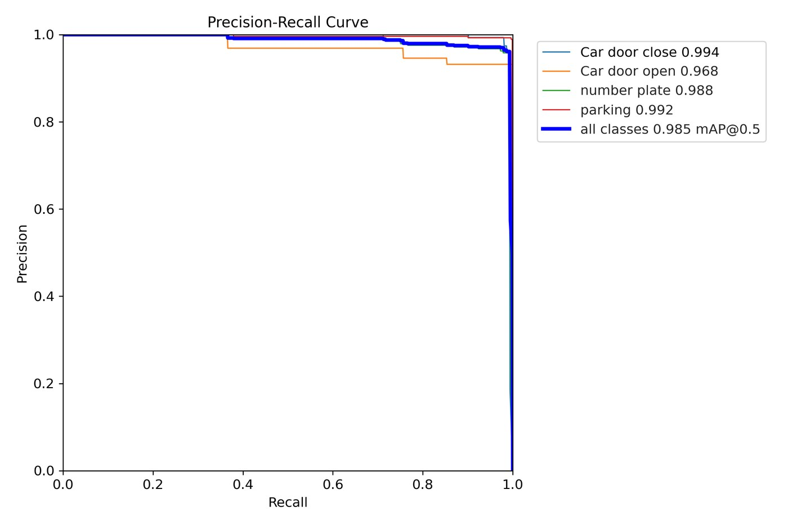
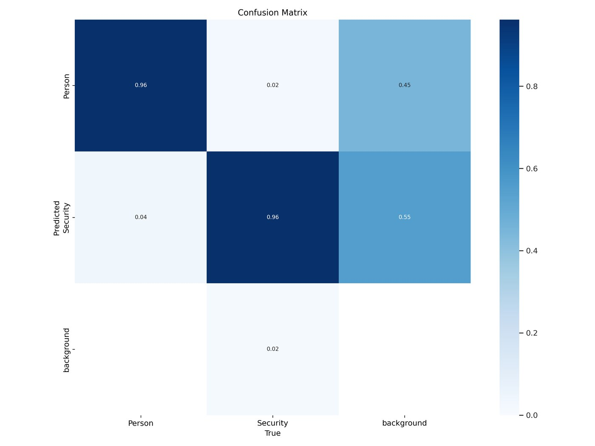

The left plot is D1. Precision stays near the top of the graph until recall is high, then drops. Closed door is the strongest class, with average precision 0.994. Open door is the weakest of the four, at 0.968. On the confusion matrix, 2% of closed doors are called open, which is the remnant of the old glass-and-door confusion, and the 0.70 confidence gate sits on top of it. Plate average precision is 0.988 and parking is 0.992. The all-class figure is 0.985.

The right plot is D2. Rows are the prediction and columns are the true class. Person and security are both recalled at 0.96. Four percent of staff are called a person, and two percent of people are called staff. Those are the mistakes an operator would see: a missed vest, or a bright jacket read as one. They are small beside the 44% robber failure of the single model. Person average precision is 0.995 and security is 0.992.

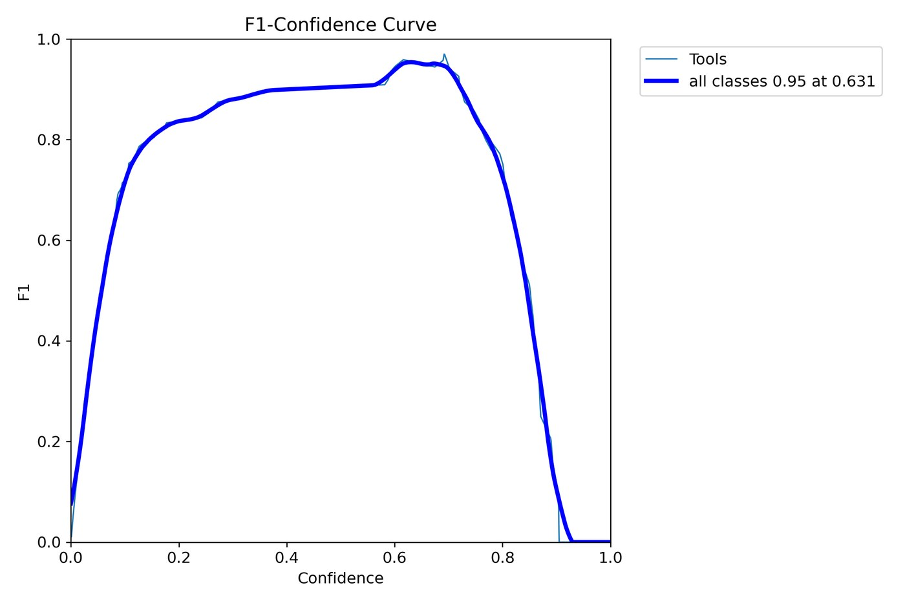

The tools curve climbs to about 0.95 around the middle of the confidence axis and has collapsed by the time confidence reaches 0.95. The legend reads a best F1 of 0.95 at confidence 0.631. The jack is a small object. As the person steps away it becomes a few pixels, and while it is swung inside the car the box disappears. When the jack is visible the box is usually in the right place, which is why the mAP is still 0.984. A strict threshold throws the small object away, which is why the right-hand side of this curve falls to zero. On a 102-frame robber clip the tool was tracked on 90.78% of frames. The dissertation evaluates a 70-epoch run. The zip stored next to the checkpoint is named for 30 epochs. The file to load is `best.pt` in `All YOLOv5 Models/TOOLS`.

The four messages the dashboard can write are these.

- **Car door open.** D1 reports `Car door open` above 0.70.
- **Manual robbery.** A person overlaps the car, the door is open, and today is not the booking end date.
- **Potential robbery.** A tool box overlaps a person box.
- **Someone is breaking in.** A tool box overlaps both the person and the car.

A person opening their own door on the booked day produces the door-open line and does not produce manual robbery. A jack on the ground away from them does not produce potential robbery. A person whose jack meets both their body and the car produces the break-in line.

## Repository layout

| Path | What it holds |
| --- | --- |
| `All YOLOv5 Models/D1` | Vehicle-state weights. `best.pt`, plus the training archive marked batch 30, 70 epochs. |
| `All YOLOv5 Models/D2` | Person and security-vest weights. `best.pt`, plus the 70-epoch archive. |
| `All YOLOv5 Models/TOOLS` | Tool detector. `best.pt`, plus the archive marked batch 30, 30 epochs, best result. |
| `MainProjectComponentsDevelopment/ModelDeployment` | Scripts that load the three detectors and draw the alerts. |
| `MainProjectComponentsDevelopment/HomographyDash` | Combined detector and top-down dashboard experiment. |
| `MainProjectComponentsDevelopment/LSTM + RCNN` | Retired action classifier and its `.h5` weights. |
| `MainProjectComponentsDevelopment/Skeleton Extraction` | Retired MediaPipe pose experiments. |
| `MainProjectComponentsDevelopment/Firebase` | Alert and booking helpers for Firebase. |
| `ModelTraning/Model-YOLOv5` | YOLOv5 training notebook. |
| `Model evaluation code` | Label-count, box-overlap, box-distance, and speed checks. |
| `ProjectProcessingPrograms` | Frame reduction and CVAT polyline conversion. |
| `SecurityDash` | PyQt5 security dashboard. |
| `TestingResources` | Sample frames used while wiring the detectors. |
| `docs/model-selection-report.md` | Full model report, with every figure described. |
| `docs/MODELS.md` | Class lists, thresholds, and weight paths. |

The deployment scripts still point at absolute paths on the original development machine (`Models/D1/best.pt`, `Models/D2/best.pt`, `Models/Tools/best.pt`). Point those paths at the three `best.pt` files under `All YOLOv5 Models` before running them.

## Stack

Python, PyTorch, Ultralytics YOLOv5m, OpenCV, PyQt5, EasyOCR, and Firebase for accounts, bookings, and alerts. The retired experiments also use MediaPipe Pose and TensorFlow/Keras.

Training of the detectors was done on a Lambda Cloud A100 (40 GB GPU memory). The dissertation records a training cost of $90.21 across two months.

## Datasets

The footage was filmed for this project, reduced from 60 fps to a still every two seconds, and annotated in CVAT. Polygon outlines were converted to YOLOv5 labels through Roboflow. The links recorded with the original project notes are:

- Dataset 1: https://kaggle.com/datasets/d268fae98c8c13e7c31e0f2b328a4e605035f1aa163bd83cecb8f41b596fbc3d
- Dataset 2: https://kaggle.com/datasets/b3a87b94bd147d6166e6a5a8a8f284d15ea54b1fe9cee2d080e60cb803ad3039

## Citation

Singh, A. (2023). *Parking Security System For Detecting Abnormal Behaviour*. BSc dissertation, Department of Computer Science, University of Reading. Supervisor: James Ferryman.

The figures on this page and in the [model selection report](docs/model-selection-report.md) are taken from that dissertation.

## Credentials

Do not commit Firebase service-account keys. `.gitignore` ignores `accountKey.json`. A key that is already in the history of this repository should be revoked in the Firebase console and replaced with a key that stays on the machine that runs the dashboard.
