# Models

This catalogue describes every model in the Parking Security System: what it is, the style of detector or classifier, the classes it knows, how it was trained, where the weights live, and how it behaved on the held-out footage.

The system that ships is three YOLOv5m detectors. Two earlier ideas, a MediaPipe skeleton and a video action classifier, were trained and then dropped because they did not hold up on this footage. EasyOCR is used as a plate reader. It was not trained for this project.

Numbers and figures below are from Arpanjot Singh's dissertation, *Parking Security System For Detecting Abnormal Behaviour* (University of Reading, May 2023), checked against the weight files in this repository. Where the dissertation text and a plotted legend disagree, both readings are given and the plot is the one that matches the curve.

## Status

| Model | Style | Status | Weights in this repository |
| --- | --- | --- | --- |
| D1, vehicle state | YOLOv5m, single-stage detector | In the alert pipeline | `All YOLOv5 Models/D1/best.pt` |
| D2, people | YOLOv5m, single-stage detector | In the alert pipeline | `All YOLOv5 Models/D2/best.pt` |
| Tools | YOLOv5m, single-stage detector | In the alert pipeline | `All YOLOv5 Models/TOOLS/best.pt` |
| Single seven-class YOLOv5 | YOLOv5, one detector for every class | Retired | Training run was not kept |
| Skeleton | MediaPipe Pose landmarks | Retired | Inference scripts only |
| Action classifier | 3D CNN on frame differences | Retired | `MainProjectComponentsDevelopment/LSTM + RCNN/convlstm_model___Date_Time_2023_01_17__16_31_01___Loss_0.002333042910322547___Accuracy_0.9982788562774658.h5` |
| Plate reader | EasyOCR, pretrained text recogniser | Used at deployment | Not stored here |

## How the three detectors work together

Each production model sees the same camera frame. Their boxes are merged, and alerts are decided from class names, confidence, rectangle overlap, and the booking date. A learned "robber" class was tried and abandoned: robbers and ordinary people look too alike for a box classifier. A person becomes a threat only when a tool box meets them, or when they overlap an open door outside the booked window.

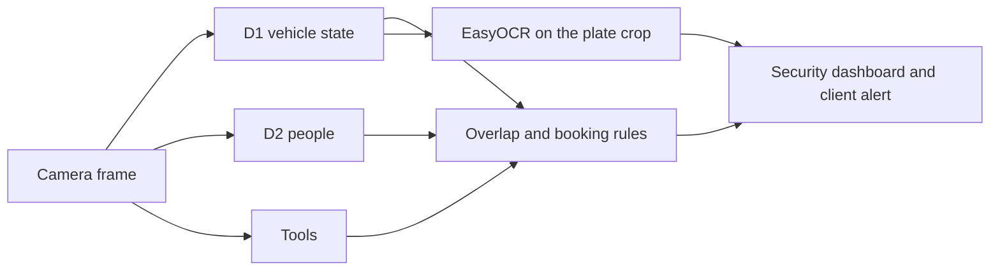

| Alert | Rule in the deployment code |
| --- | --- |
| Car door open | D1 class `Car door open` with confidence above 0.70. |
| Manual robbery | A person box overlaps the car, the door-open flag is set, and today's date is not the booking end date. |
| Potential robbery | A tool box overlaps a person box. |
| Someone is breaking in | A tool box overlaps both the person and the car. |

Confidence gates used when a box is accepted into that logic: person above 0.50, security vest above 0.60, open door above 0.70. Every detection from the tools model is treated as a tool.

The class strings the alert script matches are `Car door open`, `Car door close`, `number plate`, `Person`, and `Security`. Parking is predicted by D1 and drawn on the frame. The alert rules do not branch on it.

## Shared detector style

D1, D2, and the tools model are the same kind of network, trained apart so that a large car and a small jack do not fight for the same set of features.

YOLOv5m is a single-stage, anchor-based detector.

- The backbone is CSP-Darknet. The medium (`m`) checkpoint was chosen because it has more layers than the nano and small variants.
- The neck is the usual YOLOv5 path-aggregation neck, which mixes fine detail with a wider view of the frame.
- The head predicts, for each anchor, an objectness score, a class, and an axis-aligned box.
- Training loss, as plotted for D2, is the standard three-part YOLOv5 loss: box, objectness, and classification.
- The starting point is the official YOLOv5m weights, then fine-tuned on the filmed parking footage.

The visual style of a result is an axis-aligned rectangle with the class name and confidence on the box. The three models are drawn onto one frame, so a single view can show a closed door, a plate, and the parking bays together.

Annotation style matters as much as the architecture. Labels were drawn as polygons in CVAT, outlining the object rather than a loose rectangle, and Roboflow converted the COCO export into YOLOv5 rectangles. For car doors, the polygon takes in the door and the car body, and only the lower part of an open door. The glass is left out so the network does not learn the person, the grass, and the glare behind the window as part of the door.

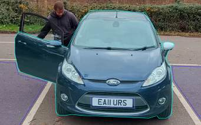

Shared training recipe for the production detectors:

| Setting | Value |
| --- | --- |
| Weights | YOLOv5m, pretrained |
| Image size | 1280×720, as recorded in the dissertation |
| Batch size | 30 |
| Epochs | 70 for D1 and D2. See the tools section for the file that is checked in. |
| Split | 70% train, 20% validation, 10% test |
| Images | About 800 for D1 and D2. About 1,200 for tools. |
| Machine | Lambda Cloud A100, 40 GB GPU memory, 250 GB system memory |

The training notebook is `ModelTraning/Model-YOLOv5/YOLOv5ModelTrain.ipynb`.

Evaluation uses the Ultralytics confusion matrix, F1-confidence curve, and precision-recall curve, plus three custom checks in `Model evaluation code`:

- Label counter. Per-frame count of predictions against the COCO ground truth, plotted over the clip.
- Overlap. Intersection over Union between each prediction and the matching ground-truth box.
- Centre distance. Pixel distance between the predicted box and the ground-truth box.

The custom checks were run on held-out clips: about 100 frames of the security scenario for D1 and for D2, and 102 frames of the robber scenario for the tools model.

## D1, vehicle state

D1 answers a narrow question: what is the car doing, and which car is it? It is the first model loaded in the deployment scripts (`model1`, path `Models/D1/best.pt`).

| | |
| --- | --- |
| Classes | `Car door close`, `Car door open`, `number plate`, `parking` |
| Weights | `All YOLOv5 Models/D1/best.pt` |
| Training archive | `All YOLOv5 Models/D1/D1 updated --barch 30 --epoch 70 THE BEST.zip` |
| Recipe | About 800 images, batch 30, 70 epochs, YOLOv5m, image size 1280×720 |

The first D1 run mis-scaled number plates because one batch of plates had been boxed as rectangles while the rest of the set was polygons. Every plate was redrawn as a polygon and the model was trained again on the same recipe. A second fault was doors labelled open when they were only slightly ajar. Those were relabelled as closed, on the grounds that the visible door surface had barely changed, and the model was trained once more.

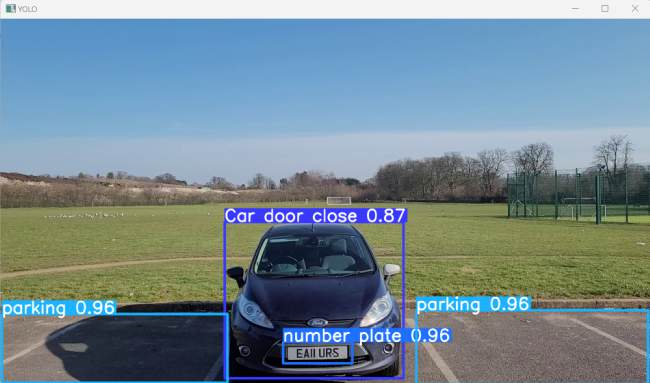

### Results

On the Ultralytics validation plots the all-class F1 is 0.98 at confidence 0.603, and mAP at IoU 0.50 is 0.985.

| Class | Precision-recall, AP at IoU 0.50 | Confusion-matrix recall | Label-counter success on the 100-frame clip |
| --- | --- | --- | --- |
| Car door close | 0.994 | 0.97 | 94% |
| Car door open | 0.968 | 1.00 | 97% |
| number plate | 0.988 | 0.99 | 97% |
| parking | 0.992 | 1.00 | 93% |

The 2% of closed doors called open is the only mix-up the dissertation calls out between the two door states. Parking is the weakest of the four on the label counter, and it is also the class the alert rules ignore.

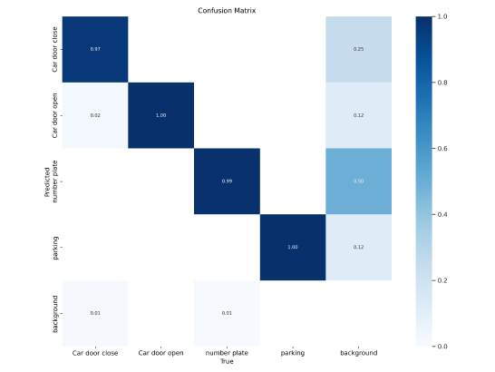

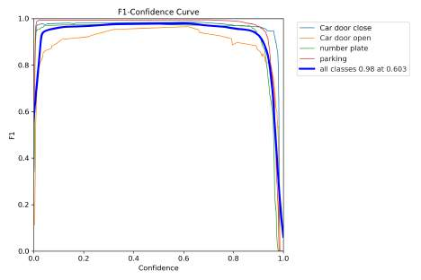

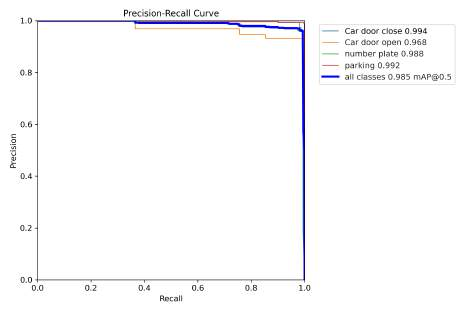

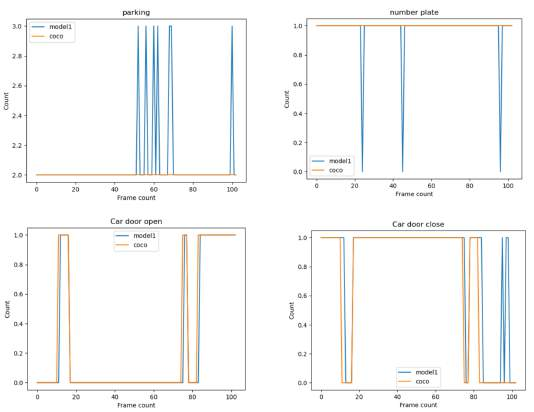

On the overlap and distance plots, door overlap sits roughly between the high 0.70s and the low 0.90s across the clip, and the centre-distance trace sits mostly between about 230 and 280 pixels, with a few spikes. The dissertation summarises the door overlap as 65% at the low end and 80% at the high end, and the centre distance as 230 to 280 pixels.

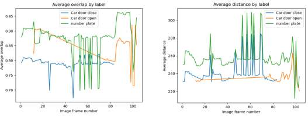

## D2, people

D2 separates a member of the public from staff. Staff are learned from the security vest, not from a face. It is `model2` in the deployment scripts (`Models/D2/best.pt`).

| | |
| --- | --- |
| Classes | `Person`, `Security` |
| Weights | `All YOLOv5 Models/D2/best.pt` |
| Training archive | `All YOLOv5 Models/D2/D2-V1 --batch 30 --epochs 70.zip` |
| Recipe | About 800 images, batch 30, 70 epochs, YOLOv5m, image size 1280×720 |

An early run fired on vests that had been labelled too small. Those boxes were removed and the model was trained again. Four further runs, and a sweep of epoch counts from 30 to 120, were worse or no better. Past 120 epochs the validation loss rose, so the 70-epoch run was kept. The training curves for that run are below: box, objectness, and classification loss fall on both the train and validation splits, and mAP at 0.50 levels off near the top of the scale well before epoch 70.

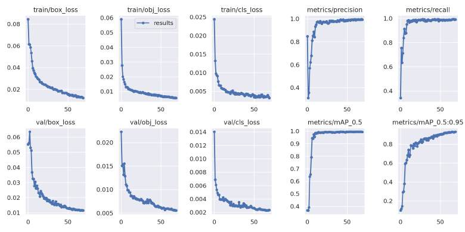

### Results

The F1 curve peaks at 0.99 at confidence 0.653. A later summary sentence in the dissertation quotes 0.973 for the same model. The curve legend is the number used here. mAP at IoU 0.50 is 0.994.

| Class | AP at IoU 0.50 | Confusion-matrix recall | Label-counter success |
| --- | --- | --- | --- |
| Person | 0.995 | 0.96 | 94% |
| Security | 0.992 | 0.96 | 96% |

The off-diagonal rates on the confusion matrix are small: 0.04 of security staff called a person, and 0.02 of people called security. Overlap with the ground-truth boxes runs from about 0.72 to 1.00 for security and from about 0.70 to 0.98 for person. The dissertation treats a 15 to 30 percent gap against a hand-drawn box as acceptable, because the outline of a person is a judgement call.

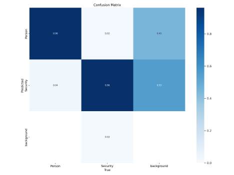

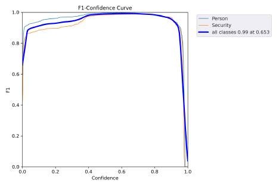

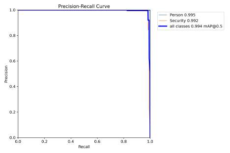

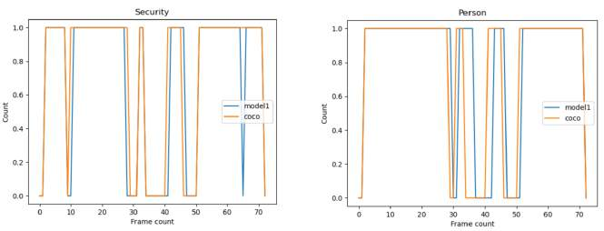

## Tools

The tools model exists so the system can tell a person who is walking past a car from a person who is carrying a jack. The filmed object is a car jack. The class on the result plots is `Tools`. In the alert script every box from this model is stored as a tool, and the alert fires only when that box meets a person or a car. It is `model3` (`Models/Tools/best.pt`).

| | |
| --- | --- |
| Class | `Tools` |
| Weights | `All YOLOv5 Models/TOOLS/best.pt` |
| Training archive | `All YOLOv5 Models/TOOLS/ToolJackOnly --batch 30 --epochs 30 BEST RESULT.zip` |
| Recipe in the dissertation | About 1,200 images, batch 30, 70 epochs, same image size and pretrained `m` weights as D1 |

The dissertation's opening line for this section names the classes as security and person. That line is carried over from the D2 write-up. The confusion-matrix discussion, the F1 plot, and the label-counter plot all show a single class, Tools.

There is a second mismatch to keep in mind when loading weights. The dissertation evaluates a 70-epoch training run. The archive stored next to `best.pt` is named for a 30-epoch run and marked as the best result. The `best.pt` in this folder is the checkpoint to load. The zip name is the only record of the epoch count for that particular file.

### Results

This is the weakest of the three detectors, for a geometric reason: a jack is a small object, and it gets smaller as the person walks away from the camera. When the jack swings inside the car during a strike, the box disappears and overlap falls to zero for those frames.

The F1 plot legend reads 0.95 at confidence 0.631, which is YOLOv5's usual "best F1, at this confidence" caption. The dissertation text states the same pair of numbers the other way round, an F1 of 0.631 at a threshold of 0.95. The drawn curve peaks near 0.95 around the middle of the confidence axis and has already collapsed by 0.95, so the legend is the reading that matches the plot. mAP at IoU 0.50 is 0.984. On the 102-frame robber clip the label counter tracks the tool on 90.78% of frames. Overlap on the frames where the tool is found runs from about 0.60 to 0.98.

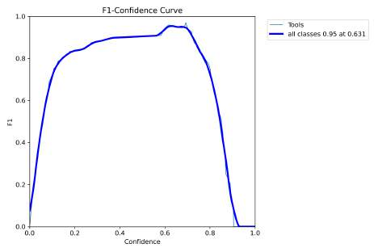

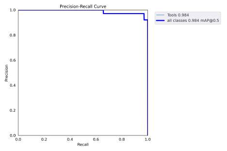

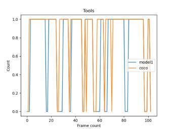

## Retired: one detector for every class

Before the split, a single YOLOv5 model was trained on about 900 images and seven classes:

`Car`, `Person`, `Staff Vest`, `Door Open`, `Robber`, `Mask`, `Parking Space`.

The Ultralytics results file for that run was not saved, so there is no confusion matrix or mAP for it. The label counter and a visual check were enough to drop it.

| Class | Label-counter success |
| --- | --- |
| Mask | 95% |
| Door open | 95% |
| Car | 88% |
| Staff vest | 85% |
| Person | 83% |
| Parking space | 69% |
| Robber | 44% |

The robber class failed because a robber and a person were both labelled as ordinary boxes, with no reliable visual difference. Vest and mask boxes also swallowed the head, arms, and face, so the model learned the person rather than the vest or the mask. Door boxes included the glass, and therefore the legs, the vest, and the glare behind it. Parking boxes had been copied from frame to frame and often contained a slice of car or person. On a second clip, any visible door on a neighbouring car was called open, which would have raised a false door-open alert.

The frame below is that failure in one image. The people at the car are labelled `Person` at 0.68, and several patches of tarmac are labelled `Parking Space`.

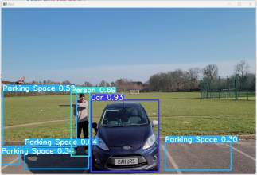

Masks were dropped as well. A mask is small at this camera distance, and a later requirement to wear one would have turned every visitor into a false alarm.

The fix was the split described above: doors and plates in D1, people and vests in D2, tools on their own, and the robber decision moved out of the classifier and into the overlap rules.

## Retired: skeleton

The first attempt at behaviour was a pose. `MainProjectComponentsDevelopment/Skeleton Extraction` runs MediaPipe Pose on top of OpenCV. Each frame is converted from BGR to RGB, MediaPipe returns the body landmarks, and the joints and limbs are drawn back onto the frame. The preview window is resized to 1280×720.

MediaPipe was chosen because it detects a person and returns skeletal keypoints without a custom training set. On this footage it was not stable enough to build a behaviour model on.

- Detection depended on how tall the person sat in the frame, on the light, and on clothing colour.
- Split lighting made one person look like two objects. Raising the brightness helped some frames and was not a general fix.
- Greyscale removed some of the clothing-colour failures. Dark clothing, especially black, still left the model with very little edge to follow.
- A person cut off by the frame produced joints in the wrong place, including ankle points plotted halfway up the shin.
- An empty frame still received a skeleton, scattered across the image.

A pose model that invents a body when the bay is empty cannot be a source of security alerts. The approach was stopped, and the write-up of that decision is section 6.1 of the dissertation. The scripts remain in the repository as the record of the experiment.

## Retired: action classifier

The folder is named `LSTM + RCNN`. The design written up in the dissertation is a region-based convolutional detector for the person in each frame, followed by an LSTM over those features so the model can tell a normal visit from a break-in across time. The network that was actually trained, in `LSTM + RCNN  Traning code.py`, is a 3D convolutional classifier on frame-difference images. There is no recurrent layer and no R-CNN in that file. The saved weight file uses the same `convlstm_model` prefix.

| | |
| --- | --- |
| Classes | `abnormal`, `normal` |
| Input | 59 frame-difference images, each 64×113, RGB, divided by 255 |
| Body | Conv3D 32, then 64, then 64 filters, kernel 3×3×3, ReLU. Each block is followed by MaxPool3D with pool and stride 1×2×2. |
| Head | Flatten, dense 512 with ReLU, dropout 0.5, dense 2 with softmax |
| Loss and optimiser | Categorical cross-entropy, Adam, accuracy |
| Training | Batch 32, at most 50 epochs, early stopping on validation loss with patience 10. 75/25 train-test split, then 20% of the training split held out for validation. Seed 27. |
| Weights | `MainProjectComponentsDevelopment/LSTM + RCNN/convlstm_model___Date_Time_2023_01_17__16_31_01___Loss_0.002333042910322547___Accuracy_0.9982788562774658.h5` |

Frame differencing was meant to avoid hand-labelling people. Subtracting the previous frame leaves the moving person and suppresses the parked cars. Clips were cut to one second in DaVinci Resolve, into a `normal` folder and an `abnormal` folder. That edit took about four days.

Training stopped near epoch 25. Validation loss fell until about epoch 10 and then sat between 0.00 and 0.05. Validation accuracy climbed to about epoch 8 and then sat between 0.98 and 1.00. The filename records loss 0.002333 and accuracy 0.998279.

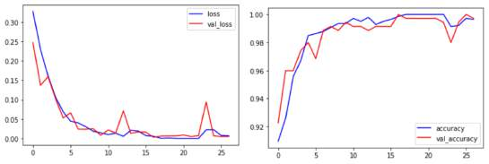

Those curves did not survive contact with a one-minute test video, scored once per second. The confusion matrix was comfortable on normal behaviour and weak on abnormal behaviour: fewer than 10 abnormal predictions against an expected 15 to 20. The abnormal stretches were found, then placed about 2 seconds away from the true event, and they lasted about 2.3 seconds against true events of about 10 seconds.

The difference images were noisy because the training footage was shot by hand. Camera shake moves the whole background, and other people and vehicles on the road survive the subtraction. The tripod footage used at test time is much cleaner, so the model was scored on a different kind of image from the one it trained on. Training on the raw frames instead of the differences would have needed a much larger set than a single custom shoot could supply. The detector approach needed less of that labelling, and it is the one that remained in the dashboard.

The comparison of true and predicted labels from the deployment tests is in `MainProjectComponentsDevelopment/LSTM + RCNN/Model deployment/abnormal_labels_comparison.csv`.

## Plate reader and the top-down view

Two pieces of the running system are not models trained for this project, and they are easy to mistake for ones.

**EasyOCR** reads the registration from the plate crop that D1 localises. The deployment method writes the crop to an image and calls `easyocr.Reader(['en'])`. The text is then matched to a booking so the alert can name the client. EasyOCR's own weights are downloaded by that library. They are not in this repository.

**Homography** is a geometry step, not a learned model. The security dashboard maps the camera frame onto a top-down plan of the bays. Cars are drawn as orange rectangles and people as green rectangles, so an operator can see someone walk around a vehicle without interpreting perspective. The combined experiment lives in `MainProjectComponentsDevelopment/HomographyDash`. The dashboard itself is `SecurityDash`, a PyQt5 application that loads the three YOLOv5 weights, authenticates against Firebase, and keeps a short clip when an alert fires.

## Where to start in the code

| Task | File |
| --- | --- |
| Train a YOLOv5 detector | `ModelTraning/Model-YOLOv5/YOLOv5ModelTrain.ipynb` |
| Run all three detectors and draw boxes | `MainProjectComponentsDevelopment/ModelDeployment/Updated Model Deploy.py` |
| Run the alert rules and the plate reader | `MainProjectComponentsDevelopment/ModelDeployment/Model Deploy Alerts + OCR.py` |
| Count predictions against ground truth | `Model evaluation code/Check model prediction count per class/Label Count V6 Final.py` |
| Measure box overlap | `Model evaluation code/Check bounding boxes overlap` |
| Train the retired action classifier | `MainProjectComponentsDevelopment/LSTM + RCNN/Model Traning/LSTM + RCNN  Traning code.py` |
| Draw a pose | `MainProjectComponentsDevelopment/Skeleton Extraction/Skeleton extraction V2.py` |

## Source

Singh, A. (2023). *Parking Security System For Detecting Abnormal Behaviour*. BSc dissertation, Department of Computer Science, University of Reading. Supervisor: James Ferryman. Submitted 1 May 2023.

The figures on this page are reproduced from that dissertation (Chapter 6). They come from the compressed PDF, so fine text on the plots is soft. The metric tables quote the legends on those plots and the success rates stated in the chapter.
