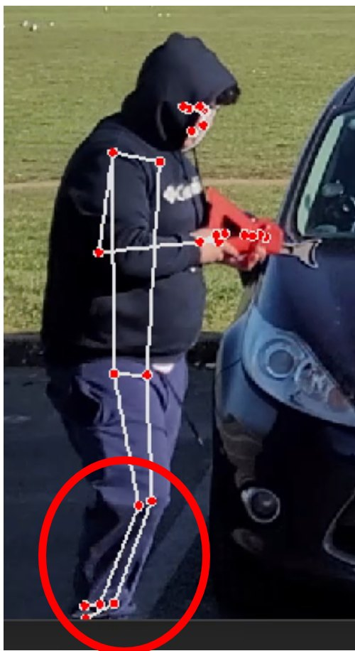
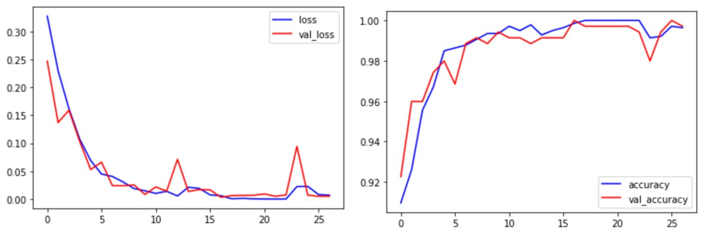
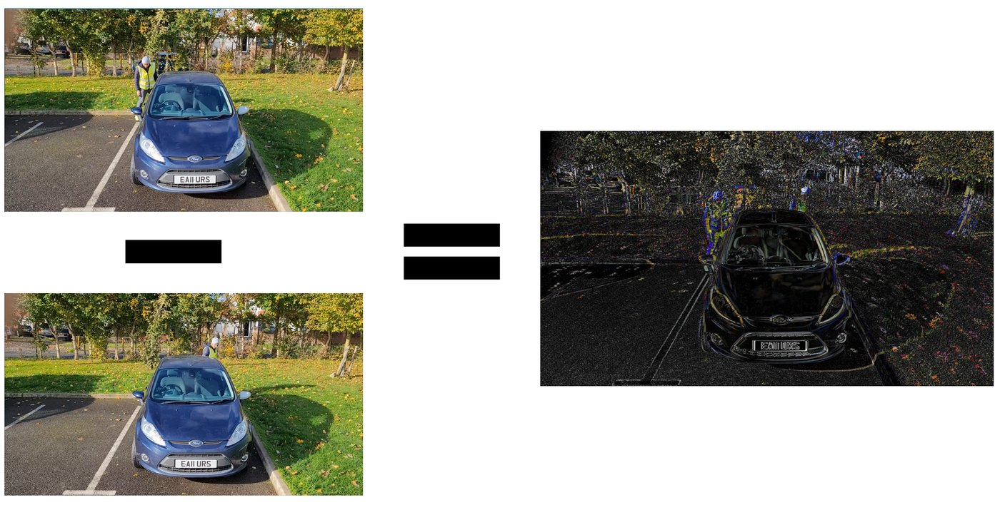
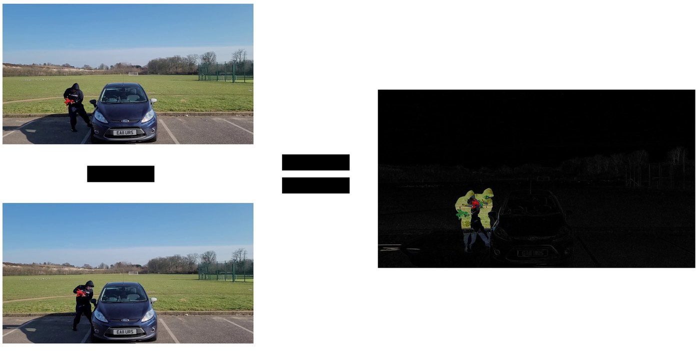
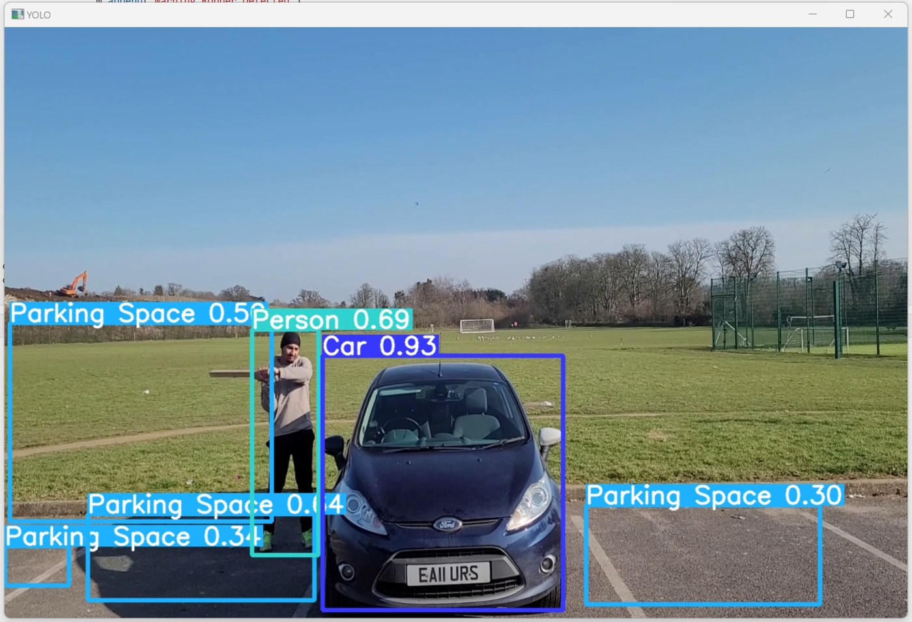
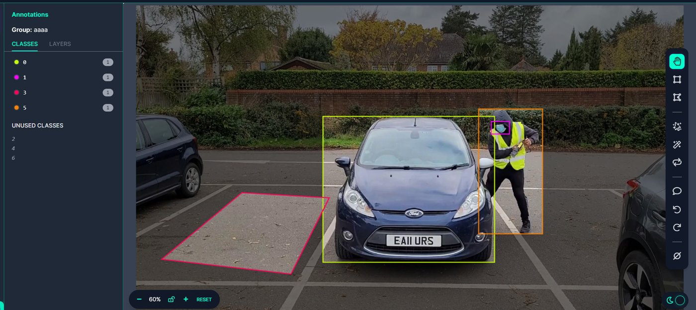
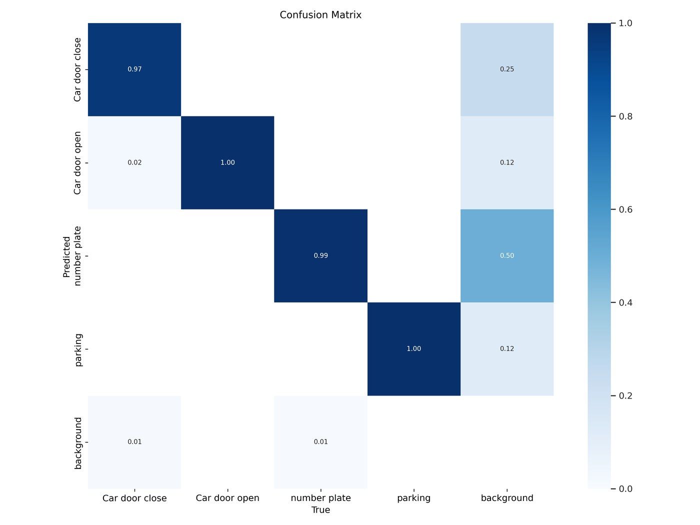
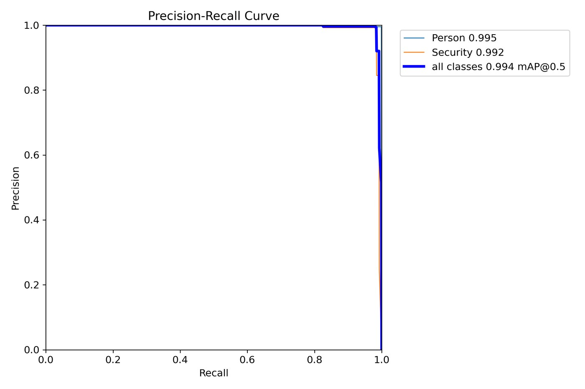

# Choosing the detection models

A report on the Parking Security System: what each model is, how it looks on a frame, and why the project kept three YOLOv5 detectors after trying a pose model, an action classifier, and a single seven-class detector.

**Arpanjot Singh**
Department of Computer Science, University of Reading
BSc Computer Science, May 2023
Supervisor: James Ferryman

This report is written from the dissertation *Parking Security System For Detecting Abnormal Behaviour*, using the figures in that document and the weight files and alert code in this repository. It is the narrative. The class lists, confidence gates, and file paths are collected again, in shorter form, in [MODELS.md](MODELS.md).

## 1. What the system had to recognise

Parking theft is common enough, and ordinary CCTV is a weak answer to it. A person watching a wall of screens loses a large part of their attention after about twenty minutes. The project set out to put a model on the camera instead, so that a break-in at a bay raises an alert while someone can still do something about it.

The objectives were more specific than "detect theft". The model had to notice suspicious action around a parked car, such as a door being opened or a lock being forced. It had to pick out things associated with a break-in, including a mask or a tool such as a hammer, a screwdriver, or a jack. It had to tell parking staff from other people, because a member of staff at a car is not the same event as a stranger at a car. And it had to show all of that on a dashboard, with the footage, so an operator was not left with a bare alarm.

Four designs were built, in this order, and only the last one is loaded by the dashboard.

| Order | Design | What a single output was supposed to mean |
| --- | --- | --- |
| 1 | MediaPipe Pose | The joints of a person, from which suspicious movement would be read |
| 2 | Action classifier, filed as LSTM + RCNN | One second of video, labelled normal or abnormal |
| 3 | One YOLOv5 detector | One of seven classes: car, person, staff vest, open door, robber, mask, parking space |
| 4 | Three YOLOv5m detectors, then overlap rules | Door state, plate, person, staff vest, and a tool, each from its own model |

The dissertation's own summary of that sequence is short. The skeleton and the action model did not hold up on a single car in a frame. Object detection with boxes did. Inside object detection, one model asked to learn every class at once was not stable, and the split into three models is the version that was deployed.

The rest of this report is the evidence for that summary: what each picture shows, what the model was doing in it, and which fault made the next design necessary.

## 2. The camera, because every later failure starts here

The models never saw an abstract "parking lot". They saw one lens, about 2.5 m above the ground, looking along a bay. A person standing in front of the car is large. The front of the car fills the middle of the frame. Anything at the rear of the car, or three bays further down an aisle, is small.

The second photograph is the aisle that a real installation would have to cover. A red outline marks the wedge the camera is being asked to watch. Near the lens the cars are large and partly side-on. Further down the row they shrink into the dark end of the garage, and a person between them is a few pixels wide. Number plates on those distant cars are not readable. A jack in someone's hand would not be readable either.

Two practical consequences follow, and both come back in the model results.

Small objects disappear first. A mask, a face, and a car jack are already difficult when the person is standing at the front bumper of the training car. They are not available at all on a car at the far end of this aisle. That is why a mask class was later abandoned, and why the tools model is the weakest of the three that were kept.

The shape of a door depends on the angle. In the training footage a door is a broad panel swinging toward the camera. On a car parked side-on in the aisle, the same door is a thin edge. A detector trained on the broad panel will not reliably call that edge "open". Ian of The Parking Consultancy Ltd made the same point after seeing the system: the model expects the car from the front, and putting a camera on every bay so that every car is front-on is expensive.

The footage the weights were trained on is the front-on view. It was filmed for the project, with participants acting normal visits and staged break-ins, then reduced from 60 frames a second to one still every two seconds so that the set could be outlined by hand. The outlines were drawn in CVAT and converted to YOLOv5 labels through Roboflow. It is a careful view of one bay. It is not a view of the aisle in the photograph above.

## 3. A theft was rewritten as objects that have to meet

The first objectives describe a theft as behaviour: lingering, forcing a lock, carrying a tool. Behaviour is a poor thing to draw a box around. Two people can stand in the same place, and only one of them is a problem. The design that survived stopped asking the network to output the word "robber". It asked the network for the pieces, and a short piece of code decides whether those pieces form a theft.

A normal visit, in this definition, is a person at their own car, on a day the booking says the car may leave, with the door open and no tool in the overlapping boxes. A break-in is a person who is not staff, whose box meets the car, whose tool meets both them and the car, or whose open door belongs to a plate that should still be parked. Staff are not recognised by face. They are recognised by the high-visibility vest, which is large enough to see from 2.5 m.

That rewrite is the reason a detector could be trained at all on a few hundred custom images. It is also the reason the first two models were set aside. Both of them tried to learn "suspicious" as one label, and neither could point at the door, the plate, and the jack that the alert has to name.

## 4. The skeleton model

### What it is

The first implementation is MediaPipe Pose, in `MainProjectComponentsDevelopment/Skeleton Extraction`. OpenCV reads the video. Each frame is converted from BGR to RGB, because that is the colour order MediaPipe expects. The pose model returns landmarks for one body and the connections between them, and those points are drawn back onto the frame. The preview window is resized to 1280×720. There is no training step and no parking dataset. The model is a general human-pose network, used as it comes.

The hope was that the joints would show someone reaching into a car: an arm extended, a torso bent over the window, a second person close to the door. A jack on the ground, a plate, and the door itself are not landmarks, so they would have needed another model later. The skeleton was only ever going to be the person half of the system.

### What the pictures show

On a clear, front-on frame the pose does find the person. In the figure below the person is bent over the driver's side in dark clothing. The landmarks sit on the hood, the shoulder, and the arm, and then the lower body collapses into one long line down the leg. The red jack on the tarmac, which is the actual tool in the scene, has no representation at all. A behaviour rule written on these points would see a bent figure. It would not see the tool, and it would be reading a leg that has been drawn in the wrong place.

When the car hides part of the body, the same model invents the missing joints. In the close crop below, the person is side-on and the car cuts across the hands. The face landmarks are scattered beside the hood rather than on the face. The legs are two lines that do not follow the trousers, and the circled points at the bottom are ankles placed well away from the shoes. Those points would be training data if a second model were taught to recognise theft from the skeleton. It would be taught the error.

The failure that removes the model from a security system is the empty bay. With nobody in the frame, MediaPipe still returns a body. Here the body is drawn across the bonnet: a shoulder on the windscreen, a hip near the headlight, a leg running down toward the plate. An alert of the form "a person is at the car" would fire on an empty parking space. Brightness, greyscale, and lighter clothing were all tried in the dissertation, and each of them fixed some frames. None of them stopped the model drawing a person who was not there, and none of them is available in a real car park, where clothing and sun cannot be controlled.

### Why it was not kept

The skeleton was dropped because the landmarks were not stable on this camera, and because a pose has no class for the objects the alert has to name. Height in the frame, split light, dark clothes, and a person cut off by the car all moved the joints. An empty frame still produced a skeleton. The scripts remain in the repository as the record of the experiment. The dashboard does not load them.

## 5. The action classifier

### What it is, and what the folder name suggests

The next experiment tried to classify time. A one-second clip would be normal or abnormal, and the model would say which. In the dissertation the design is called LSTM + RCNN. The written idea is a region-based detector finding the person in each frame, then a recurrent network reading that sequence so the model can tell a visit from a break-in across time.

The network that was trained is not that design. `LSTM + RCNN  Traning code.py` builds a 3D convolutional classifier. There is no LSTM layer and no region-proposal stage in the file. The saved weight is named `convlstm_model`, which records the intention rather than the layers. The description below is of the network that exists in the repository.

Each clip is turned into differences between consecutive frames. The previous frame is subtracted from the current one, the result is resized to 64 pixels by 113, and the values are divided by 255. Fifty-nine of those difference images are the input. The subtraction was meant to leave the moving person and wipe out the parked cars, so the clips would not have to be labelled with boxes. Cutting the clips to one second, into a `normal` folder and an `abnormal` folder, took about four days in DaVinci Resolve.

The body of the network is three Conv3D blocks. The first has 32 filters, the next two have 64, and each filter is 3×3×3 with a ReLU activation. After every convolution there is a max-pool with size and stride 1×2×2, so time is kept and the image is reduced. A flatten layer, a dense layer of 512 units, dropout of 0.5, and a two-class softmax follow. The loss is categorical cross-entropy, the optimiser is Adam, and the reported metric is accuracy. Training used batches of 32, a maximum of 50 epochs, early stopping when validation loss failed to improve for 10 epochs, a 75/25 train-test split, and a further 20% of the training split held out for validation. The seed is 27. Training stopped near epoch 25.

The weight file records the score it was saved with:

`MainProjectComponentsDevelopment/LSTM + RCNN/convlstm_model___Date_Time_2023_01_17__16_31_01___Loss_0.002333042910322547___Accuracy_0.9982788562774658.h5`

### What the training curves show, and what they hide

Loss falls for both the training split and the validation split, and from about epoch 8 the accuracy of both sits between roughly 0.98 and 1.00. Validation loss is down near zero after epoch 10, with a small spike late in the run. On the clips the model was shown, it has learned to separate the two folders.

A one-minute video, scored once per second, is a different test. The blue line in the figure below is the true label. There are three abnormal stretches, and each of them lasts many seconds: the first runs from about clip 2 to clip 12, the second from about clip 28 to clip 37, the third from about clip 43 to clip 51. The orange line is the model's label. It stays on normal through almost all of those stretches, and it marks abnormal as a narrow spike: one clip near 21, one near 40, and a short run near 44 to 50. The dissertation measured those predicted abnormal stretches at about 2.3 seconds against true events of about 10 seconds, and placed them about 2 seconds away from the true event. The model notices that something in the minute was abnormal. It does not say when the break-in was happening.

### Why the difference images caused that gap

The subtraction that was supposed to isolate the person isolates whatever moves, including the camera. The training footage was shot by hand. In the pair below, the car and the person have barely changed between the two frames, but the trees and the bay lines have shifted. The difference image on the right is full of foliage, kerb, and the outline of the whole car. The person in the yellow vest is a small part of that picture. The network was trained on noise of that kind.

The test footage was shot on a tripod. The same subtraction now does what the method wanted. The background is almost black, and the bright region is the person and the jack moving at the door. That is a cleaner input, and it is not the input the model trained on. A high validation score on the handheld clips does not transfer to the tripod clips, because the two difference images are pictures of different things.

Reshooting every clip on a tripod would have removed the camera shake. It would not have produced the range of people, clothes, and actions an action model needs, and labelling every second by hand was already more work than drawing boxes on stills. The detector approach needed less of that labour, and it can name the door and the tool. The action classifier was stopped there. Its weights and the comparison CSV of true against predicted labels remain in `MainProjectComponentsDevelopment/LSTM + RCNN`.

## 6. One YOLOv5 model for every class

### What it is

YOLOv5 is a single-stage detector. One pass over the image proposes boxes, and each box carries a class and a confidence. There is no separate stage that first searches for regions and then classifies them. The variant used later, YOLOv5m, starts from the official medium checkpoint: a CSP-Darknet backbone, a path-aggregation neck that mixes fine detail with a wider view of the frame, and a head that predicts objectness, class, and an axis-aligned box. The visual style of a result is that rectangle, with the class name and the confidence printed on it.

The first YOLOv5 experiment put every class into one of these models. About 900 images were labelled with seven classes: `Car`, `Person`, `Staff Vest`, `Door Open`, `Robber`, `Mask`, and `Parking Space`. The Ultralytics results file for the run was not saved, so there is no confusion matrix and no mAP. A label counter, which compares how many boxes the model draws with how many were drawn by hand, and a look at the frames, were enough to stop.

| Class | Share of the hand-drawn boxes the counter agreed with |
| --- | --- |
| Mask | 95% |
| Door open | 95% |
| Car | 88% |
| Staff vest | 85% |
| Person | 83% |
| Parking space | 69% |
| Robber | 44% |

The high scores are real and they are misleading. Mask and door-open agree often because the box is easy to count, not because the pixels inside the box are the right object. The robber score is the one that removes the model from the dashboard.

### What a break-in frame looks like under this model

On a staged theft the people at the car are reported as `Person`, at 0.68 in the frame below, and the car itself is reported correctly. Several patches of empty tarmac are reported as `Parking Space`, including boxes that contain no bay at all. There is no robber box. The class the alert was supposed to read is absent on the frame where a robber is present. At this distance a person breaking in and a person unlocking their own car wear the same kind of clothes, and both were drawn as ordinary rectangles. The network had nothing reliable to hang the robber class on, so it used the person class.

### What the labels taught it

The boxes in the training set included the background, and the network learned the background.

In the annotation frame below, the yellow rectangle is the car and is a reasonable outline. The orange rectangle, which is the staff vest, contains the vest and also the hood, the arms, the legs, and the tool. The purple rectangle, which is the mask, is a few pixels of face. The pink quadrilateral, which is the parking space, is a patch of tarmac with no car in it. A model trained on the orange box learns a person. A model trained on the purple box learns a speck. A model trained on the pink box learns asphalt.

Door labels had the same fault, and it shows up as a false alarm. In the frame below the main car is closed and is correctly called `Car` at 0.93. The car on the left is also closed. A sliver of its door, seen edge-on, is called `Door Open` at 0.83, and the arrow in the figure marks that box. Parking boxes again cover tarmac and the neighbouring cars. If the alert rule is "any open door is an alarm", this frame alarms on a car nobody is touching.

The mask class was removed for a second, practical reason. During a requirement to wear a mask, every visitor would have matched it. At 2.5 m the mask is also too small to be a stable feature, which is why the high count in the table did not survive as a reason to keep the class.

## 7. The three models that were kept

### The change in the labels

The repair was to stop asking one network to separate classes that look alike, and to stop drawing boxes that contain the wrong pixels. The footage was labelled again, three times, once for each model. Polygons in CVAT follow the outline of the object. Roboflow turns those polygons into the rectangles YOLOv5 trains on. The glass of the door is left outside the polygon, so the person, the hedge, and the glare behind the window are not part of the door. A door that is only slightly ajar was relabelled as closed, because the visible panel had barely changed and the model had been calling those two states the wrong way round. Plates that had been drawn as rectangles, while everything else was a polygon, were redrawn. The mixture had been stretching the plate box away from the plate.

The zoomed frame below is the old style. The car rectangle includes a large amount of the scene around the bumper. The door rectangle includes the glass and the mirror. A parking quadrilateral runs off across the tarmac. Small boxes near the mirror try to catch a person and a vest and mostly catch the window.

The frame below is the style that was kept. A polygon follows the body of the car, including the open door as part of that outline, and stops at the metal rather than at a loose rectangle. A separate polygon sits on the plate. The bay markings are outlined on their own, along the painted lines, rather than as a box of asphalt. This is a slower way to label. It is the reason D1 can tell a door from the person standing behind the glass.

### What each model is for

All three are YOLOv5m, started from the official pretrained medium weights and fine-tuned on the relabelled frames. The medium checkpoint was chosen because it has more layers than the nano and small variants, and the objects range from a car that fills the frame to a jack that does not. The dissertation records an image size of 1280×720, a batch of 30, 70 epochs, and a split of 70% train, 20% validation, and 10% test. D1 and D2 used about 800 images. The tools model used about 1,200. Training ran on a Lambda Cloud A100 with 40 GB of GPU memory. The recorded cost over two months was $90.21.

D2 was also trained with epoch counts from 30 to 120. After 120 epochs the validation loss rose, so the 70-epoch weights were kept. An earlier D2 run detected vests that had been labelled too small; those boxes were removed and the model was trained again.

The three models answer three different questions, and the alert code never asks one of them to answer another's question.

**D1, the vehicle model**, reports `Car door close`, `Car door open`, `number plate`, and `parking`. Its job is the state of the car and the identity of the car. The plate box is cropped and passed to EasyOCR, which was not trained in this project, and the text is matched to a booking. Parking is drawn on the frame so an operator can see the bay. The alert rules do not branch on the parking class. The door class is the one that matters: `Car door open` above 0.70 confidence sets the door-open flag.

**D2, the people model**, reports `Person` and `Security`. Security means the vest. A face is too small, and a face would also raise the privacy problem a reviewer later named. A person box is kept when confidence is above 0.50. A vest is kept above 0.60. Staff at a car and a stranger at a car are different events because of this class, not because of a second behaviour model.

**The tools model** reports `Tools`. In the footage the tool is a car jack. The alert script does not inspect the class string. Every box from this model is stored as a tool, and it only becomes an alarm when the rectangle overlaps a person, or overlaps both the person and the car. A jack lying on the other side of the bay does not overlap the person, so it does not alarm. That overlap is the replacement for the robber class that scored 44%.

### How to read the scores

Mean average precision at an intersection-over-union of 0.50 asks whether the predicted box lands on the hand-drawn box at least half-overlapping, and whether the class is right, averaged over classes. An F1 score is the balance of precision and recall at a chosen confidence. The confidence printed next to an F1 in a YOLOv5 legend is the threshold at which that F1 was best, not a second copy of the F1. Where the dissertation text swaps those two numbers, the legend is the reading used here, because it matches the shape of the curve.

| Model | Classes the weights contain | Role in the alert | Result on the held-out clips |
| --- | --- | --- | --- |
| D1 | `Car door close`, `Car door open`, `number plate`, `parking` | Door state, and the plate crop | F1 0.98 at confidence 0.603. mAP at IoU 0.50 is 0.985. |
| D2 | `Person`, `Security` | Who is at the car | F1 0.99 at confidence 0.653. mAP at IoU 0.50 is 0.994. |
| Tools | `Tools` | Whether a tool meets the person and the car | mAP at IoU 0.50 is 0.984. Best F1 on the plot is 0.95 at confidence 0.631. |

Per-class average precision at IoU 0.50, from the precision-recall legends:

| D1 class | AP | D2 class | AP |
| --- | --- | --- | --- |
| Car door close | 0.994 | Person | 0.995 |
| Car door open | 0.968 | Security | 0.992 |
| number plate | 0.988 | | |
| parking | 0.992 | | |

### D1 in more detail

The confusion matrix counts, for each true class, where the prediction went. The diagonal is the success. Closed door is recalled at 0.97, open door at 1.00, plate at 0.99, and parking at 1.00 on this validation view. The fault the dissertation calls out is the 0.02 of closed doors placed in the open-door column. That is the remnant of the old problem, where a nearly closed door and an open door shared pixels, and it is small enough that the 0.70 confidence gate in the alert script is there to sit on top of it.

On a separate 100-frame security clip, the label counter agreed with the hand labels on 97% of plates, 97% of open doors, 94% of closed doors, and 93% of parking bays. Parking is the weakest of the four on that counter, which is acceptable because the alert does not use it. Door overlap with the hand-drawn box sits roughly from the high 0.70s into the low 0.90s. Centre distance between the predicted box and the hand-drawn box is summarised in the dissertation as about 230 to 280 pixels.

The precision-recall curve stays high across almost the whole recall range and then drops. Door-close is the strongest class on this plot, at 0.994. Open door is the weakest of the four, at 0.968, which matches the only mix-up in the confusion matrix. The all-class mAP at IoU 0.50 is 0.985.

On a held-out front-on frame the same model draws a closed door at 0.87 around the body of the car, a plate at 0.96 on the bumper, and the two bays at 0.96 along the painted lines. That is the picture the relabel was aiming at. The door box is the car, the plate box is the plate, and the parking boxes follow the bays rather than a patch of grass.

### D2 in more detail

D2 has an easier visual problem than "robber versus person", and a harder one than "car versus background". A vest is a large, bright region. A person without a vest is the rest of the body. The confusion matrix shows both classes recalled at 0.96. Four percent of staff are called a person, and two percent of people are called staff. Those are the errors an operator would see: a vest missed, or a bright jacket called a vest. They are small next to the 44% robber failure, and they are the reason the threshold on the vest is set higher (0.60) than the threshold on a person (0.50).

The precision-recall curve for D2 is almost a corner. Person average precision is 0.995 and security is 0.992, and the all-class mAP at IoU 0.50 is 0.994. A later sentence in the dissertation quotes an F1 of 0.973 for this model. The curve legend says 0.99 at confidence 0.653, and that is the number used here. Overlap with the hand-drawn boxes runs from about 0.72 to 1.00 for security and from about 0.70 to 0.98 for person. The dissertation treats a gap of 15 to 30 percent against a hand-drawn outline of a person as acceptable, because two annotators will not draw that outline in the same place.

On the label counter, security agreed with the ground truth 96% of the time and person 94%.

### The tools model in more detail

This is the weak model, and the reason is the camera in section 2. A jack is small. As the person steps away from the lens it becomes a few pixels, and while it is swung inside the car the box disappears. On the frames where the tool is found, overlap with the hand label runs from about 0.60 to 0.98. On the frames where it has gone inside the car, overlap falls to zero. The label counter still tracked the tool on 90.78% of a 102-frame robber clip, which is enough for an overlap rule and not enough to trust a tool box on its own.

The F1 curve climbs to about 0.95 around the middle of the confidence axis and has collapsed by the time confidence reaches 0.95. The legend reads a best F1 of 0.95 at confidence 0.631. One sentence in the dissertation states those two numbers the other way round, an F1 of 0.631 at a threshold of 0.95. The curve has already fallen by that threshold, so the legend is the reading that matches the plot. Average precision for the tools class, and the all-class mAP at IoU 0.50, are both 0.984. The high mAP and the fragile F1 are compatible: when the jack is visible and the box is accepted, the box is in the right place, and a strict confidence threshold throws the small object away.

The dissertation text evaluates a 70-epoch run, on the same recipe as D1. The archive stored beside the checkpoint is named `ToolJackOnly --batch 30 --epochs 30 BEST RESULT.zip`. The file the dashboard should load is `best.pt` in that folder. The zip name is the only epoch count written on that particular archive. The opening sentence of the tools section in the dissertation also names the classes as security and person. That sentence was carried over from the D2 write-up. The plot shows one class, Tools.

### How a frame becomes an alert

The three models run on the same frame. Their boxes are collected, and four messages are possible. The numbers are the gates in `Model Deploy Alerts + OCR.py`.

| Message on the frame | What must be true |
| --- | --- |
| Car door open | D1 reports `Car door open` with confidence above 0.70. |
| Manual robbery | A person box overlaps the car, the door-open flag is set, and today's date is not the booking end date. |
| Potential robbery | A tool box overlaps a person box. |
| Someone is breaking in | A tool box overlaps the person and also overlaps the car. |

A person opening their own door on the day the booking ends produces the door-open line and does not produce manual robbery, because the date check passes. A jack on the ground away from the person produces a tool box and does not produce potential robbery, because the rectangles do not meet. A person whose jack meets both their body and the car produces the break-in line. That is the whole of the "robber" logic. It is a few overlap tests, which is why it can be read and changed, and why it does not depend on a class the seven-class model could not learn.

The dashboard figure below is that logic on one frame. D1 has drawn `Car door close` at 0.96 around the car, `number plate` at 0.91 on the bumper, and `parking` at 0.96 and 0.95 on the bays. D2 has drawn `Person` at 0.87. The tools model has drawn `Tools` at 0.68 on the jack in the person's hands. The door is shut, so there is no door-open alarm. The tool rectangle meets the person rectangle, so the banner at the top of the window is POTENTIAL ROBBERY, and the dashboard has started sending that alert to the booked client. On the right, the homography view reduces the same scene to an orange block for the car and a green mark for the person, which is the top-down picture an operator uses when several bays are open in tabs. Each tab runs on its own thread. A two-second clip is stored when an alert fires.

### Where the weights are

| Model | Checkpoint | Training archive beside it |
| --- | --- | --- |
| D1 | `All YOLOv5 Models/D1/best.pt` | `D1 updated --barch 30 --epoch 70 THE BEST.zip` |
| D2 | `All YOLOv5 Models/D2/best.pt` | `D2-V1 --batch 30 --epochs 70.zip` |
| Tools | `All YOLOv5 Models/TOOLS/best.pt` | `ToolJackOnly --batch 30 --epochs 30 BEST RESULT.zip` |

The deployment scripts still point at absolute paths on the original development machine (`Models/D1/best.pt` and the matching D2 and Tools paths). Those paths have to be changed to the three `best.pt` files above before the scripts will run on another machine.

## 8. Why the three-model design was the one that shipped

The four designs were not interchangeable attempts at the same output. Each one defines a theft differently, and the pictures above show where that definition broke.

The skeleton defines a theft as a body in a suspicious arrangement. On this camera the body is often wrong, sometimes invented, and it never includes the jack. The action classifier defines a theft as an abnormal second. The validation accuracy near 0.998 says the training clips were separable, and the timeline says the second it chose was not the second the break-in occupied. The seven-class detector defines a theft as a robber box. The box was not there when the person was, because the label had no visual difference from an ordinary person, and the surrounding labels had taught the network the tarmac and the glass. The three-model design defines a theft as a meeting of boxes the camera can resolve: a door, a person, a vest, a jack, and a plate checked against a booking.

| Question | Skeleton | Action classifier | One YOLOv5 | Three YOLOv5m models |
| --- | --- | --- | --- | --- |
| What a detection actually is | Joints of one body | One label for a whole second | One box, seven possible classes | Three boxes, each from a specialist |
| Door, plate, and jack | Not represented | Not represented | Present as classes, and mixed with the background | Each has its own model and its own label style |
| Empty bay | A skeleton is drawn on the car | The second can be called normal | Parking boxes appear on tarmac | The pose failure is gone. Door and parking still need the confidence gates |
| Score on the training view | Unstable under light, clothing, and occlusion | Validation accuracy 0.98 to 1.00 | Robber agreed 44% of the time. Car and door-open counted higher | mAP at IoU 0.50 of 0.985, 0.994, and 0.984 |
| The same model on a new clip | Joints moved or appeared with nobody present | Events were about 2 seconds late and about 2.3 seconds long | A closed side door was called open at 0.83 | Held-out security and robber clips, with the jack as the weak class |
| How a thief is declared | Never implemented | The class `abnormal` | The class `Robber` | Overlap of person, tool, and car, plus the booking date |
| Labelling cost | None, and the output was not usable | About four days of one-second clips, then a tripod mismatch | About 900 images, boxes full of background | The same footage, outlined three times as polygons |

The three-model design was kept because it was the only one that could name the objects in the original objectives with features this camera actually has. Staff are a vest. A break-in is a tool meeting a person and a car. An unexpected departure is an open door whose plate is not booked out today.

The cost of that choice is the edge of the training set. A hammer that does not look like the jack, a person at the rear bumper, and a side-on door in the aisle of the coverage photograph are outside what these weights were measured on. The system knows the objects it was shown.

## 9. What the finished system still does not do

The conclusion of the dissertation marks the behaviour, robber, and staff requirements as met, on the strength of the evaluation in section 6.3.4. Several items from the original specification were not built. The model does not keep learning after deployment. The dashboard does not show parking-lot statistics such as how full the site is. The client application does not meet accessibility guidelines. Integration with a third-party access-control system was not tested. The alert text is available for another system to consume, which is as far as that requirement went.

Ian, of The Parking Consultancy Ltd, watched a demonstration. He described per-bay monitoring of this kind as unusual in the market. He also named the deployment problems that the camera photographs already imply. A camera on every bay is expensive. The detector wants the car from the front. Storing faces or plates raises a GDPR question, which is one reason the people model uses a vest rather than a face, and one reason facial recognition was suggested by him and not added. He suggested trying the same idea on electric-vehicle charging bays. A check of the read plate against the DVLA record of stolen plates was left as future work.

Those limits sit next to the metrics on purpose. An mAP of 0.985 is a result about a front-on bay, filmed and labelled for this project. It is not a result about the multi-storey aisle.

## 10. Where the code for each design lives

| To look at | Open |
| --- | --- |
| Class lists, thresholds, and weight paths in short form | [MODELS.md](MODELS.md) |
| The three detectors and the four alert messages | `MainProjectComponentsDevelopment/ModelDeployment/Model Deploy Alerts + OCR.py` |
| Boxes drawn with no alert logic | `MainProjectComponentsDevelopment/ModelDeployment/Updated Model Deploy.py` |
| The YOLOv5 training notebook | `ModelTraning/Model-YOLOv5/YOLOv5ModelTrain.ipynb` |
| Label counts, box overlap, and centre distance | `Model evaluation code` |
| The action-classifier training script | `MainProjectComponentsDevelopment/LSTM + RCNN/Model Traning/LSTM + RCNN  Traning code.py` |
| True against predicted labels from the one-minute test | `MainProjectComponentsDevelopment/LSTM + RCNN/Model deployment/abnormal_labels_comparison.csv` |
| The pose experiment | `MainProjectComponentsDevelopment/Skeleton Extraction/Skeleton extraction V2.py` |
| The dashboard that loads the three weights | `SecurityDash` |

## Source

Singh, A. (2023). *Parking Security System For Detecting Abnormal Behaviour*. BSc dissertation, Department of Computer Science, University of Reading. Supervisor: James Ferryman. Submitted 1 May 2023.

The figures are reproduced from that dissertation. They were taken from the original PDF and reduced to 1400 pixels on the long side so the repository stays a reasonable size. The metric values in the tables are the numbers printed on those plots, together with the success rates stated in Chapter 6.
